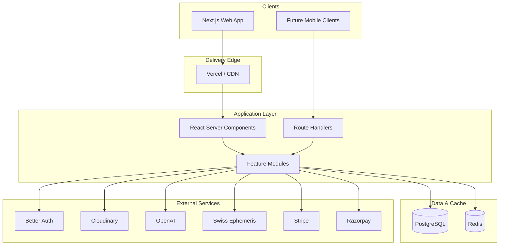

# Architecture

## System overview

## Architectural principles

1. **Feature-based modularity** — business capabilities live under `src/features/*` with clear public exports.
2. **Clean boundaries** — UI depends on hooks/services; services depend on infrastructure adapters.
3. **Server-first data** — prefer Server Components and route handlers; hydrate client islands only when interaction demands it.
4. **Strict typing** — Zod at boundaries, TypeScript strict mode, no unchecked indexed access.
5. **Dependency injection via factories/singletons** — Prisma, Redis, OpenAI, Stripe, Razorpay, Cloudinary, and Swiss Ephemeris are encapsulated services.
6. **Scale readiness** — Redis for cache/sessions, Postgres for durable state, image CDN via Cloudinary, horizontal-friendly Next.js deployment.

## Request flow

1. Browser hits App Router route group (`(landing)`, `(auth)`, `(dashboard)`).
2. Layouts compose shared chrome (navbar/sidebar/auth shell).
3. Feature sections render as Server Components with client motion/UI islands.
4. API route handlers return standardized `successResponse` / `errorResponse` envelopes.
5. Infrastructure clients are lazily initialized and reused via `globalThis` in development.

## Security posture (foundation)

- `poweredByHeader` disabled
- Environment validation helpers
- Timing-safe Razorpay signature verification
- Stripe webhook signature construction helper
- Auth secret reserved for Better Auth integration in the next phase

## Next phases

- Domain schema (users, profiles, charts, matches, conversations, subscriptions)
- Better Auth session wiring
- Matchmaking ranking pipeline
- Realtime chat
- Admin operations console
