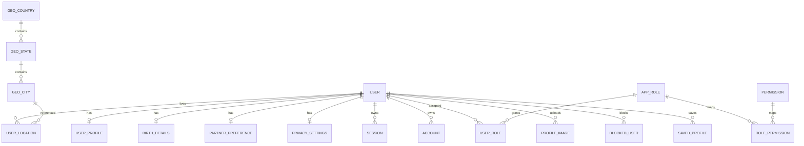
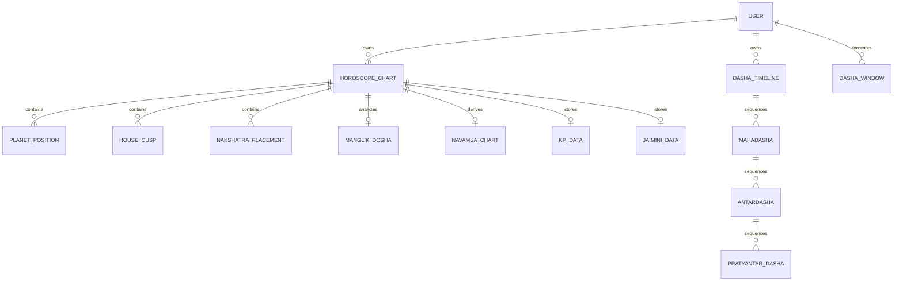
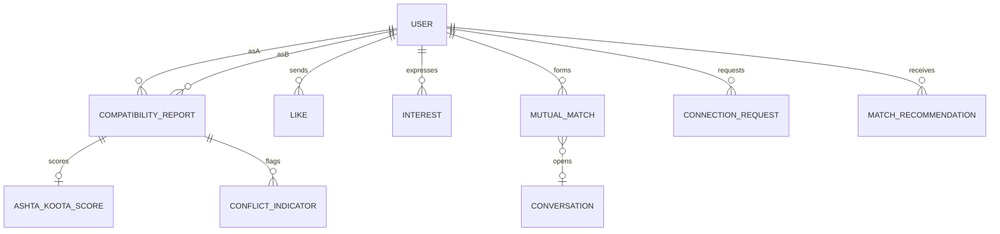
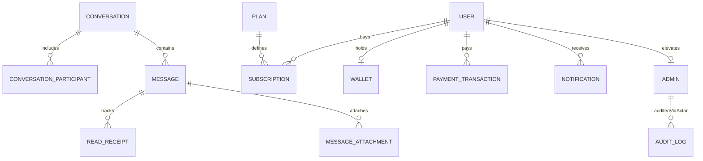

# Entity Relationship Overview

High-level Mermaid diagrams. Full FK detail lives in Prisma schema files.

## Identity & profile

## Astrology core

## Match engine & social graph

## Chat, payments, ops

## Cardinality summary

| Pattern  | Examples                                                                          |
| -------- | --------------------------------------------------------------------------------- |
| 1:1      | User↔Profile, User↔BirthDetails, Chart↔ManglikDosha                               |
| 1:N      | User→Sessions, Chart→PlanetPositions, Conversation→Messages                       |
| N:M      | User↔Role via UserRole, Role↔Permission via RolePermission, Post↔Tag              |
| Self-ref | BlockedUser, SavedProfile, Message replies, BlogComment threads, DashaPeriod tree |
